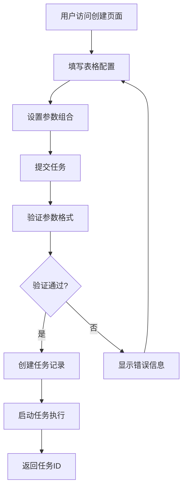
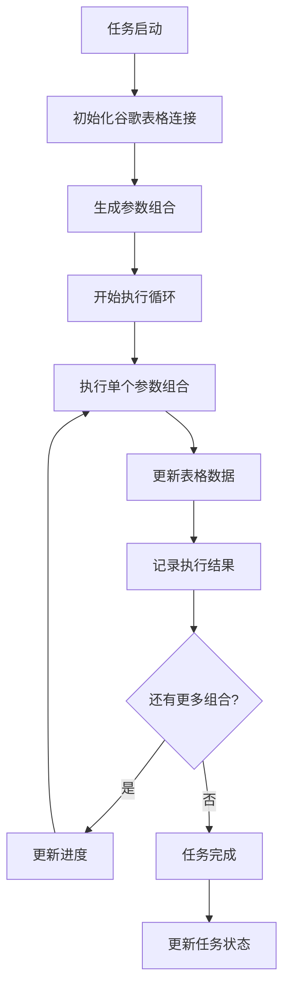
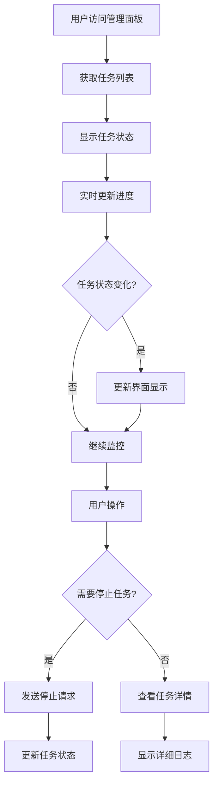

# 谷歌任务操作流程文档

## 概述

本文档详细说明了谷歌参数批量校验系统中任务的创建、检查、停止等操作流程，包含具体的代码参数、输入参数和操作思路。

## 目录

1. [系统架构概览](#系统架构概览)
2. [任务创建流程](#任务创建流程)
3. [任务检查流程](#任务检查流程)
4. [任务停止流程](#任务停止流程)
5. [任务状态说明](#任务状态说明)
6. [代码参数详解](#代码参数详解)
7. [输入参数说明](#输入参数说明)
8. [难点解决思路](#难点解决思路)
9. [常见问题解决](#常见问题解决)

---

## 系统架构概览

### 核心组件

```
┌─────────────────┐    ┌─────────────────┐    ┌─────────────────┐
│   Web界面       │    │   API接口       │    │   任务管理器    │
│  (Templates)    │◄──►│  (Routes)       │◄──►│ (TaskManager)   │
└─────────────────┘    └─────────────────┘    └─────────────────┘
         │                       │                       │
         ▼                       ▼                       ▼
┌─────────────────┐    ┌─────────────────┐    ┌─────────────────┐
│   配置管理      │    │   数据库模型    │    │ 谷歌表格服务    │
│(ConfigManager)  │    │   (Models)      │    │(GoogleSheetSvc) │
└─────────────────┘    └─────────────────┘    └─────────────────┘
```

### 数据流向

1. **用户输入** → Web界面 → API接口 → 任务管理器
2. **任务执行** → 谷歌表格服务 → 数据库存储 → 状态更新
3. **结果反馈** → 数据库查询 → API返回 → Web界面显示

---

## 任务创建流程

### 1. 准备工作

#### 1.1 配置谷歌表格
- 确保已创建谷歌表格并获取表格ID
- 在表格中设置好参数位置和检查位置
- 确保表格具有适当的访问权限

#### 1.2 系统配置
- 访问管理面板：`http://localhost:5000/admin/config`
- 配置以下参数：
  - **表格ID** (spreadsheet_id)
  - **工作表名称** (sheet_name)
  - **参数位置** (parameter_positions)
  - **检查位置** (check_positions)
  - **结果位置** (result_positions)

#### 1.3 认证配置
- 确保 `data/token.json` 文件存在且有效
- 如需要，重新进行谷歌API认证

### 2. 创建任务

#### 2.1 通过Web界面创建

**访问地址**：`http://localhost:5000/google-sheet/create`

**操作步骤**：

1. **填写谷歌表格配置**
   ```
   电子表格ID或URL: 1BxiMVs0XRA5nFMdKvBdBZjgmUUqptlbs74OgvE2upms
   工作表名称: data (或自定义)
   ```

2. **配置认证信息**
   ```
   Token类型: 文件/JSON字符串
   Token文件路径: data/token.json
   代理URL: http://proxy.example.com:8080 (可选)
   ```

3. **设置参数组合**
   ```
   参数1: ["value1", "value2", "value3"]
   参数2: ["A", "B", "C"]
   参数3: [1, 2, 3]
   参数4: ["x", "y"]
   参数5: ["test1", "test2"]
   参数6: ["final1", "final2"]
   ```

4. **点击"创建任务"按钮**

#### 2.2 通过API创建

**API端点**：`POST /api/tasks`

**请求示例**：
```bash
curl -X POST http://localhost:5000/api/tasks \
  -H "Content-Type: application/json" \
  -d '{
    "name": "Google Sheet 任务 - 2025-09-26 15:30:00",
    "description": "批量执行 108 个参数组合",
    "task_type": "google_sheet",
    "config": {
      "spreadsheet_id": "1BxiMVs0XRA5nFMdKvBdBZjgmUUqptlbs74OgvE2upms",
      "sheet_name": "data",
      "token_type": "file",
      "token_file": "data/token.json",
      "token_json": null,
      "proxy_url": null,
      "parameters": [
        ["value1", "value2", "value3"],
        ["A", "B", "C"],
        [1, 2, 3],
        ["x", "y"],
        ["test1", "test2"],
        ["final1", "final2"]
      ]
    }
  }'
```

**响应示例**：
```json
{
  "status": "success",
  "task_id": "550e8400-e29b-41d4-a716-446655440000",
  "message": "任务创建并启动成功"
}
```

### 3. 任务创建后的状态
- 任务创建成功后，状态为 `pending`（待执行）
- 任务会自动加入任务队列等待执行
- 可以在管理面板的任务列表中查看任务状态

---

## 任务检查流程

### 1. 任务状态监控

#### 1.1 通过管理面板查看
1. 访问管理面板：`http://localhost:5000/admin/`
2. 在仪表板中查看：
   - 总任务数
   - 已完成任务数
   - 运行中任务数
   - 错误任务数
3. 点击"任务管理"查看详细任务列表

#### 1.2 通过API查询

##### 1.2.1 获取所有任务
```bash
curl http://localhost:5000/api/tasks
```

**响应示例**：
```json
{
  "status": "success",
  "tasks": [
    {
      "id": "550e8400-e29b-41d4-a716-446655440000",
      "name": "Google Sheet 任务 - 2025-09-26 15:30:00",
      "description": "批量执行 108 个参数组合",
      "status": "running",
      "task_type": "google_sheet",
      "current_step": 45,
      "total_steps": 108,
      "created_at": "2025-09-26T15:30:00",
      "start_time": "2025-09-26T15:30:05"
    }
  ]
}
```

##### 1.2.2 获取特定任务
```bash
curl http://localhost:5000/api/tasks/550e8400-e29b-41d4-a716-446655440000
```

**响应示例**：
```json
{
  "status": "success",
  "task": {
    "id": "550e8400-e29b-41d4-a716-446655440000",
    "name": "Google Sheet 任务 - 2025-09-26 15:30:00",
    "description": "批量执行 108 个参数组合",
    "status": "running",
    "task_type": "google_sheet",
    "config": {
      "spreadsheet_id": "1BxiMVs0XRA5nFMdKvBdBZjgmUUqptlbs74OgvE2upms",
      "sheet_name": "data",
      "parameters": [
        ["value1", "value2", "value3"],
        ["A", "B", "C"],
        [1, 2, 3],
        ["x", "y"],
        ["test1", "test2"],
        ["final1", "final2"]
      ]
    },
    "current_step": 45,
    "total_steps": 108,
    "created_at": "2025-09-26T15:30:00",
    "start_time": "2025-09-26T15:30:05"
  }
}
```

##### 1.2.3 获取任务日志
```bash
curl http://localhost:5000/api/tasks/550e8400-e29b-41d4-a716-446655440000/logs
```

**响应示例**：
```json
{
  "status": "success",
  "logs": [
    {
      "id": 1,
      "level": "info",
      "message": "开始执行Google Sheet任务",
      "timestamp": "2025-09-26T15:30:05"
    },
    {
      "id": 2,
      "level": "info",
      "message": "生成了 108 个参数组合",
      "timestamp": "2025-09-26T15:30:06"
    },
    {
      "id": 3,
      "level": "info",
      "message": "执行参数组合 45/108",
      "timestamp": "2025-09-26T15:35:20"
    }
  ]
}
```

##### 1.2.4 实时任务状态流
```bash
curl http://localhost:5000/api/tasks/550e8400-e29b-41d4-a716-446655440000/events
```

**响应格式** (Server-Sent Events)：
```
data: {"type": "progress", "data": {"current_step": 46, "total_steps": 108, "percentage": 42.59}}

data: {"type": "log", "data": {"level": "info", "message": "执行参数组合 46/108"}}

data: {"type": "result", "data": {"step_index": 45, "success": true, "result": {"param1": "value1", "param2": "A", "result": "success"}}}
```

### 2. 任务执行过程检查

#### 2.1 实时状态更新
- 任务状态会实时更新：
  - `pending` → `running` → `completed`/`error`
- 可以通过刷新页面查看最新状态

#### 2.2 日志监控
1. 访问日志页面：`http://localhost:5000/admin/logs`
2. 查看系统日志和任务执行日志
3. 日志文件位置：`logs/app.log`

#### 2.3 任务结果检查
- 任务完成后，结果会写入谷歌表格的指定位置
- 可以在谷歌表格中直接查看结果
- 也可以通过API获取任务结果

### 3. 错误检查和处理

#### 3.1 常见错误类型
- **认证错误**：谷歌API认证失败
- **权限错误**：没有访问表格的权限
- **网络错误**：网络连接问题
- **数据错误**：表格数据格式不正确

#### 3.2 错误处理步骤
1. 查看任务日志了解具体错误信息
2. 检查系统配置是否正确
3. 验证谷歌表格权限
4. 重新执行任务或联系管理员

---

## 任务停止流程

### 1. 停止正在运行的任务

#### 1.1 通过管理面板停止
1. 访问任务管理页面：`http://localhost:5000/admin/tasks`
2. 找到状态为 `running` 的任务
3. 点击"停止"按钮
4. 确认停止操作

#### 1.2 通过API停止

##### 1.2.1 停止单个任务
```bash
curl -X POST http://localhost:5000/api/tasks/550e8400-e29b-41d4-a716-446655440000/cancel
```

**响应示例**：
```json
{
  "status": "success",
  "message": "任务已取消"
}
```

##### 1.2.2 停止所有运行中的任务
```bash
curl -X POST http://localhost:5000/api/tasks/stop-all
```

**响应示例**：
```json
{
  "status": "success",
  "message": "已停止 3 个运行中的任务",
  "stopped_tasks": [
    "550e8400-e29b-41d4-a716-446655440000",
    "550e8400-e29b-41d4-a716-446655440001",
    "550e8400-e29b-41d4-a716-446655440002"
  ]
}
```

### 2. 批量停止任务

#### 2.1 停止特定类型的任务
- 可以通过任务名称、状态等条件筛选
- 使用管理面板的批量操作功能

#### 2.2 批量操作示例
```bash
# 停止所有google_sheet类型的任务
curl -X POST http://localhost:5000/api/tasks/batch-stop \
  -H "Content-Type: application/json" \
  -d '{"task_type": "google_sheet"}'

# 停止指定状态的任务
curl -X POST http://localhost:5000/api/tasks/batch-stop \
  -H "Content-Type: application/json" \
  -d '{"status": "running"}'
```

### 3. 任务停止后的处理

#### 3.1 状态更新
- 任务状态会更新为 `stopped`
- 停止时间会记录在任务信息中
- 部分完成的结果会保留

#### 3.2 资源清理
- 系统会自动清理任务相关的临时资源
- 释放占用的内存和连接
- 更新任务统计信息

#### 3.3 重新启动
- 停止的任务可以重新启动
- 系统会从上次停止的位置继续执行
- 或者重新开始执行

---

## 任务状态说明

### 状态类型

| 状态 | 描述 | 说明 |
|------|------|------|
| `pending` | 待执行 | 任务已创建，等待执行 |
| `running` | 运行中 | 任务正在执行 |
| `completed` | 已完成 | 任务成功完成 |
| `error` | 错误 | 任务执行出错 |
| `stopped` | 已停止 | 任务被手动停止 |
| `cancelled` | 已取消 | 任务被取消 |

### 状态转换

```
pending → running → completed
    ↓         ↓         ↓
stopped ← running → error
    ↓
cancelled
```

---

## 常见问题解决

### 1. 任务创建失败

**问题**：无法创建新任务
**解决方案**：
- 检查系统配置是否正确
- 验证谷歌表格ID和权限
- 查看系统日志了解具体错误

### 2. 任务执行超时

**问题**：任务执行时间过长
**解决方案**：
- 检查网络连接
- 减少任务批次大小
- 增加任务超时时间配置

### 3. 谷歌API限制

**问题**：达到API调用限制
**解决方案**：
- 等待限制重置
- 减少并发任务数量
- 优化API调用频率

### 4. 数据格式错误

**问题**：表格数据格式不正确
**解决方案**：
- 检查表格数据格式
- 验证参数位置配置
- 确保数据类型匹配

---

## 代码参数详解

### 1. 任务模型参数 (Task Model)

```python
class Task(db.Model):
    id = db.Column(db.String(36), primary_key=True)  # UUID格式的任务ID
    name = db.Column(db.String(255), nullable=False)  # 任务名称
    description = db.Column(db.Text)  # 任务描述
    status = db.Column(db.String(20), default='pending')  # 任务状态
    task_type = db.Column(db.String(50), default='google_sheet')  # 任务类型
    config = db.Column(db.Text)  # JSON格式的配置信息
    start_time = db.Column(db.DateTime)  # 开始时间
    end_time = db.Column(db.DateTime)  # 结束时间
    current_step = db.Column(db.Integer, default=0)  # 当前步骤
    total_steps = db.Column(db.Integer, default=0)  # 总步骤数
    error_message = db.Column(db.Text)  # 错误信息
```

### 2. 任务配置参数 (Config)

```python
config = {
    "spreadsheet_id": "1BxiMVs0XRA5nFMdKvBdBZjgmUUqptlbs74OgvE2upms",  # 谷歌表格ID
    "sheet_name": "data",  # 工作表名称
    "token_type": "file",  # Token类型: file/json
    "token_file": "data/token.json",  # Token文件路径
    "token_json": None,  # Token JSON字符串
    "proxy_url": None,  # 代理URL
    "parameters": [  # 参数组合数组
        ["value1", "value2", "value3"],  # 参数1
        ["A", "B", "C"],  # 参数2
        [1, 2, 3],  # 参数3
        ["x", "y"],  # 参数4
        ["test1", "test2"],  # 参数5
        ["final1", "final2"]  # 参数6
    ]
}
```

### 3. 谷歌表格服务参数

```python
class GoogleSheetService:
    def __init__(self, config: Dict[str, Any]):
        self.config = config
        self.google_sheet = None
    
    def _init_google_sheet(self, config_data: Dict[str, Any]):
        spreadsheet_id = config_data.get('spreadsheet_id')  # 表格ID
        sheet_name = config_data.get('sheet_name', 'data')  # 工作表名
        token_file = config_data.get('token_file', 'data/token.json')  # Token文件
        proxy_url = config_data.get('proxy_url')  # 代理URL
```

### 4. API接口参数

#### 创建任务接口
```python
@api_bp.route('/tasks', methods=['POST'])
def create_task():
    data = request.get_json()
    name = data.get('name', '未命名任务')  # 任务名称
    description = data.get('description', '')  # 任务描述
    task_type = data.get('task_type', 'google_sheet')  # 任务类型
    config = data.get('config', {})  # 任务配置
```

#### 获取任务接口
```python
@api_bp.route('/tasks/<task_id>', methods=['GET'])
def get_task(task_id):
    # task_id: 任务ID (UUID格式)
```

#### 取消任务接口
```python
@api_bp.route('/tasks/<task_id>/cancel', methods=['POST'])
def cancel_task(task_id):
    # task_id: 要取消的任务ID
```

---

## 输入参数说明

### 1. 必需参数

| 参数名 | 类型 | 说明 | 示例 |
|--------|------|------|------|
| `spreadsheet_id` | String | 谷歌表格ID | `"1BxiMVs0XRA5nFMdKvBdBZjgmUUqptlbs74OgvE2upms"` |
| `sheet_name` | String | 工作表名称 | `"data"` |
| `token_file` | String | Token文件路径 | `"data/token.json"` |
| `parameters` | Array | 参数组合数组 | `[["A","B"], ["1","2"]]` |

### 2. 可选参数

| 参数名 | 类型 | 默认值 | 说明 | 示例 |
|--------|------|--------|------|------|
| `name` | String | `"未命名任务"` | 任务名称 | `"测试任务"` |
| `description` | String | `""` | 任务描述 | `"批量参数校验"` |
| `task_type` | String | `"google_sheet"` | 任务类型 | `"google_sheet"` |
| `token_type` | String | `"file"` | Token类型 | `"file"` 或 `"json"` |
| `token_json` | String | `null` | Token JSON字符串 | `'{"token":"..."}'` |
| `proxy_url` | String | `null` | 代理URL | `"http://proxy:8080"` |

### 3. 参数组合规则

#### 3.1 参数数组格式
```json
{
  "parameters": [
    ["value1", "value2", "value3"],  // 参数1: 3个值
    ["A", "B"],                      // 参数2: 2个值
    [1, 2, 3, 4]                     // 参数3: 4个值
  ]
}
```

#### 3.2 组合计算
- 总组合数 = 参数1数量 × 参数2数量 × 参数3数量
- 示例：3 × 2 × 4 = 24个组合

#### 3.3 组合示例
```
组合1: (value1, A, 1)
组合2: (value1, A, 2)
组合3: (value1, A, 3)
组合4: (value1, A, 4)
组合5: (value1, B, 1)
...
组合24: (value3, B, 4)
```

---

## 难点解决思路

### 1. 谷歌API认证问题

**问题描述**：Token过期或认证失败

**解决思路**：
```python
# 1. 检查Token文件是否存在
if not os.path.exists(token_file):
    raise FileNotFoundError(f"Token文件不存在: {token_file}")

# 2. 验证Token格式
try:
    with open(token_file, 'r') as f:
        token_data = json.load(f)
    # 验证必要字段
    required_fields = ['token', 'refresh_token', 'client_id']
    for field in required_fields:
        if field not in token_data:
            raise ValueError(f"Token文件缺少字段: {field}")
except json.JSONDecodeError:
    raise ValueError("Token文件格式错误")

# 3. 自动刷新Token
if creds.expired and creds.refresh_token:
    creds.refresh(Request())
    # 保存刷新后的Token
    with open(token_file, 'w') as f:
        json.dump(creds.to_json(), f)
```

### 2. 参数组合内存问题

**问题描述**：大量参数组合导致内存溢出

**解决思路**：
```python
# 1. 分批处理参数组合
def process_combinations_in_batches(parameters, batch_size=1000):
    combinations = itertools.product(*parameters)
    batch = []
    
    for combination in combinations:
        batch.append(combination)
        if len(batch) >= batch_size:
            yield batch
            batch = []
    
    if batch:
        yield batch

# 2. 使用生成器减少内存占用
def generate_combinations(parameters):
    for combination in itertools.product(*parameters):
        yield combination

# 3. 限制最大组合数
MAX_COMBINATIONS = 10000
total_combinations = reduce(lambda x, y: x * y, [len(p) for p in parameters])
if total_combinations > MAX_COMBINATIONS:
    raise ValueError(f"参数组合数量过多: {total_combinations} > {MAX_COMBINATIONS}")
```

### 3. 并发任务管理

**问题描述**：多个任务同时执行时的资源竞争

**解决思路**：
```python
# 1. 使用线程池限制并发数
from concurrent.futures import ThreadPoolExecutor

class TaskManager:
    def __init__(self, max_workers=5):
        self.executor = ThreadPoolExecutor(max_workers=max_workers)
        self.running_tasks = {}
    
    def start_task(self, task_id):
        if len(self.running_tasks) >= self.max_workers:
            return False
        
        future = self.executor.submit(self._execute_task, task_id)
        self.running_tasks[task_id] = future
        return True

# 2. 使用队列管理任务
import queue
from threading import Lock

class TaskQueue:
    def __init__(self):
        self.queue = queue.Queue()
        self.lock = Lock()
    
    def add_task(self, task):
        with self.lock:
            self.queue.put(task)
    
    def get_task(self):
        return self.queue.get()
```

### 4. 错误处理和重试机制

**问题描述**：网络不稳定或API限制导致的执行失败

**解决思路**：
```python
import time
from functools import wraps

def retry_on_failure(max_retries=3, delay=1):
    def decorator(func):
        @wraps(func)
        def wrapper(*args, **kwargs):
            for attempt in range(max_retries):
                try:
                    return func(*args, **kwargs)
                except Exception as e:
                    if attempt == max_retries - 1:
                        raise e
                    logger.warning(f"执行失败，第{attempt + 1}次重试: {str(e)}")
                    time.sleep(delay * (2 ** attempt))  # 指数退避
            return None
        return wrapper
    return decorator

@retry_on_failure(max_retries=3, delay=2)
def execute_parameter_combination(self, combination):
    # 执行参数组合的逻辑
    pass
```

### 5. 实时状态更新

**问题描述**：任务执行过程中需要实时更新状态

**解决思路**：
```python
# 1. 使用Server-Sent Events (SSE)
@api_bp.route('/tasks/<task_id>/events')
def task_events_stream(task_id):
    def event_stream():
        while True:
            if task_id in task_manager.task_events:
                try:
                    event = task_manager.task_events[task_id].get(timeout=1)
                    yield f"data: {json.dumps(event)}\n\n"
                except queue.Empty:
                    yield "data: {}\n\n"
            else:
                break
    
    return Response(event_stream(), mimetype='text/event-stream')

# 2. 前端使用EventSource接收更新
const eventSource = new EventSource(`/api/tasks/${taskId}/events`);
eventSource.onmessage = function(event) {
    const data = JSON.parse(event.data);
    updateTaskStatus(data);
};
```

### 6. 数据库事务管理

**问题描述**：并发操作导致的数据不一致

**解决思路**：
```python
from sqlalchemy.exc import IntegrityError
from app.extensions import db

def safe_db_operation(func):
    @wraps(func)
    def wrapper(*args, **kwargs):
        try:
            result = func(*args, **kwargs)
            db.session.commit()
            return result
        except IntegrityError:
            db.session.rollback()
            logger.error("数据库操作失败，已回滚")
            raise
        except Exception as e:
            db.session.rollback()
            logger.error(f"数据库操作异常: {str(e)}")
            raise
    return wrapper

@safe_db_operation
def update_task_status(task_id, status):
    task = Task.query.get(task_id)
    if task:
        task.status = status
        task.updated_at = datetime.utcnow()
        db.session.add(task)
```

---

## 最佳实践

### 1. 任务规划
- 合理规划任务批次大小
- 避免在高峰时段执行大量任务
- 定期备份重要数据

### 2. 监控和维护
- 定期检查系统日志
- 监控任务执行状态
- 及时处理错误任务

### 3. 性能优化
- 合理配置并发任务数量
- 优化网络连接
- 定期清理系统资源

---

## 联系支持

如果遇到无法解决的问题，请：
1. 查看系统日志获取详细错误信息
2. 检查本文档的常见问题部分
3. 联系系统管理员获取技术支持

---

## 流程图说明

### 1. 任务创建流程图



### 2. 任务执行流程图



### 3. 任务监控流程图



---

## 操作界面截图说明

### 1. 任务创建页面
- **URL**: `http://localhost:5000/google-sheet/create`
- **主要功能**:
  - 谷歌表格配置区域
  - 参数组合设置区域
  - 实时参数组合计算
  - 任务提交按钮

### 2. 管理面板首页
- **URL**: `http://localhost:5000/admin/`
- **主要功能**:
  - 任务统计概览
  - 最近任务列表
  - 系统状态信息
  - 快速操作按钮

### 3. 任务管理页面
- **URL**: `http://localhost:5000/admin/tasks`
- **主要功能**:
  - 任务列表显示
  - 任务状态筛选
  - 批量操作功能
  - 任务详情查看

### 4. 任务详情页面
- **URL**: `http://localhost:5000/google-sheet/detail/{task_id}`
- **主要功能**:
  - 任务基本信息
  - 执行进度显示
  - 实时日志查看
  - 结果数据展示

---

## 配置文件说明

### 1. 系统配置文件
**位置**: `config/config.json`
```json
{
  "spreadsheet_id": "1BxiMVs0XRA5nFMdKvBdBZjgmUUqptlbs74OgvE2upms",
  "sheet_name": "data",
  "token_file": "data/token.json",
  "proxy_url": null,
  "max_concurrent_tasks": 5,
  "task_timeout": 3600,
  "parameter_positions": {
    "param1": "B6",
    "param2": "B7",
    "param3": "B8",
    "param4": "B9",
    "param5": "B10",
    "param6": "B11"
  },
  "check_positions": {
    "check1": "I6",
    "check2": "I7",
    "check3": "I8",
    "check4": "I9",
    "check5": "I10",
    "check6": "I11"
  },
  "result_positions": {
    "result1": "I15",
    "result2": "I16",
    "result3": "I17",
    "result4": "I18",
    "result5": "I19",
    "result6": "I20"
  }
}
```

### 2. Token文件格式
**位置**: `data/token.json`
```json
{
  "token": "ya29.a0AfH6SMC...",
  "refresh_token": "1//04...",
  "token_uri": "https://oauth2.googleapis.com/token",
  "client_id": "your_client_id.apps.googleusercontent.com",
  "client_secret": "your_client_secret",
  "scopes": ["https://www.googleapis.com/auth/spreadsheets"],
  "expiry": "2025-09-26T16:30:00Z"
}
```

---

## 性能优化建议

### 1. 参数组合优化
- **分批处理**: 将大量参数组合分批执行，避免内存溢出
- **组合限制**: 设置最大组合数量限制，防止系统过载
- **进度保存**: 支持任务中断后从断点继续执行

### 2. 并发控制
- **线程池**: 使用线程池限制并发任务数量
- **资源监控**: 监控系统资源使用情况
- **队列管理**: 使用任务队列管理待执行任务

### 3. 网络优化
- **连接复用**: 复用HTTP连接减少连接开销
- **重试机制**: 实现指数退避重试策略
- **超时设置**: 合理设置网络请求超时时间

### 4. 数据库优化
- **索引优化**: 为常用查询字段添加索引
- **批量操作**: 使用批量插入减少数据库操作次数
- **连接池**: 配置数据库连接池提高性能

---

## 安全注意事项

### 1. 认证安全
- **Token保护**: 妥善保管谷歌API Token文件
- **权限控制**: 使用最小权限原则配置API权限
- **定期更新**: 定期更新和轮换认证凭据

### 2. 数据安全
- **敏感数据**: 避免在日志中记录敏感信息
- **数据备份**: 定期备份重要配置和数据
- **访问控制**: 限制系统访问权限

### 3. 网络安全
- **HTTPS**: 生产环境使用HTTPS加密传输
- **防火墙**: 配置防火墙规则限制访问
- **代理配置**: 安全配置代理服务器

---

*最后更新：2025年9月26日*
